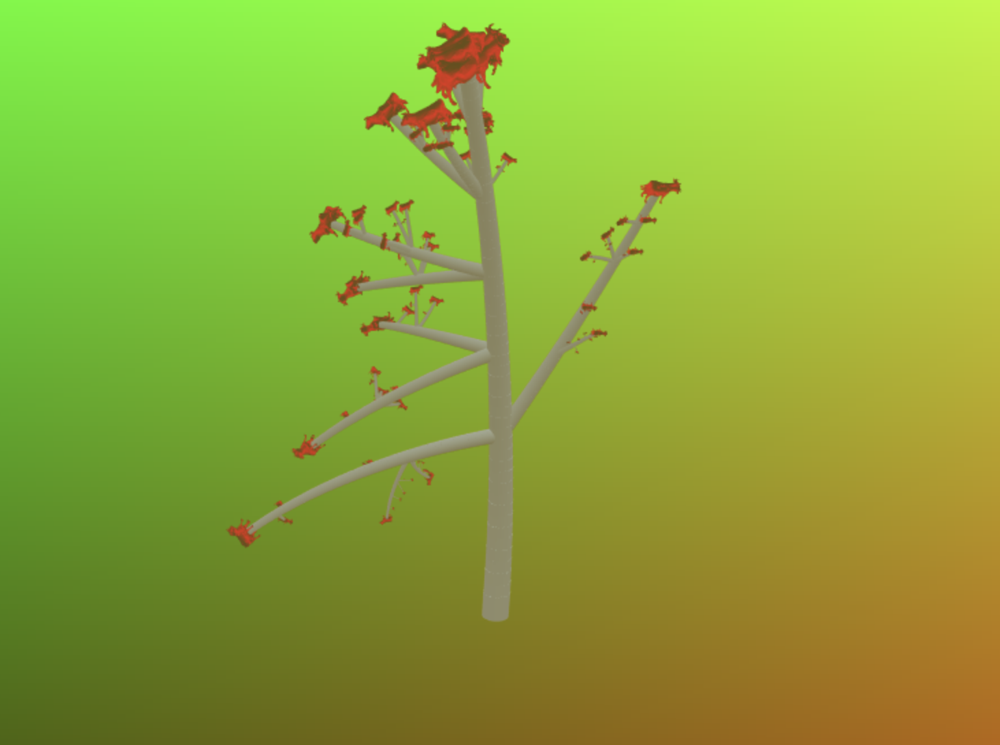

# L-System Tree

A project by Nicholas Keenan. Pennkey: nkeenan.
Demo link: https://nkeenan.github.io/hw04-l-systems

## Tree

The tree begins with a trunk that expands with the L-System. The trunk continues upward with some slight curvature. Off of each trunk expansion is a number of branches in different directions. The number of branches and the directions they go in are random with equal probability. 

## Leaves

The leaves are added when an expansion character is encountered, so they are always at the ends of branches. I didn't have time to make a leaf .obj file so I used some cows instead. I like the cows and I hope you do too.